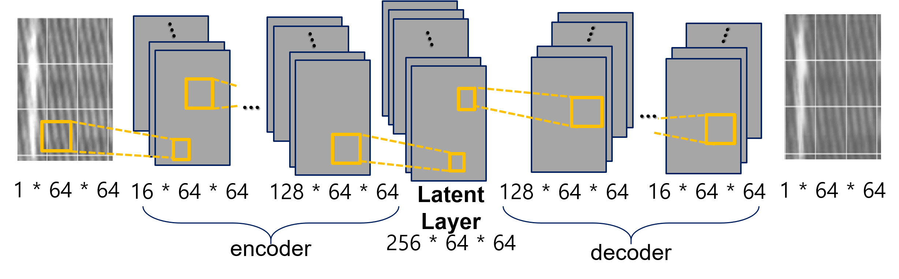
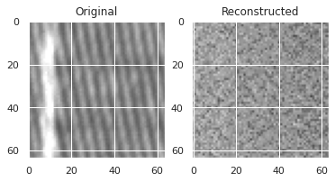
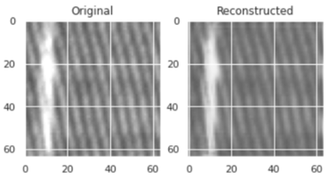

# Fabric-Defect-Detector
## 1. 개요
- 목표 \
Detect defection of Fabric Database \
소량의 정상 섬유 이미지 데이터로 결함이 있는 섬유를 검출해낼 수 있는 딥러닝 학습 모델 제시.

- 프로젝트 소개 \
supervised learning을 위해 라벨링 작업을 하거나 임의로 결함 데이터를 생성하는 것은 비효율적이다. 
따라서, unsupervised learning을 통해 정상 데이터로만 결함을 검출하고자 한다.

  - Challenges
    - 데이터 양이 적다.
    - 정상 데이터만으로 모델을 학습시킨다.
  : 챌린지 극복을 위해 고화질의 이미지를 64 * 64 패치로 잘라내어 학습 데이터를 크게 증가시켰고, 정상 데이터만을 가지고 unsupervised learning model(Autoencoder)을 학습시키는 방법을 택했다.

## 2. 데이터
[AITEX사](https://www.aitex.es/afid/)에서 제공하는 섬유 이미지 데이터를 활용. 
- 원본 NoDefect(정상), Defect(결함)이미지를 구분해서 각각 디렉토리에 저장한다.
- getData.ipynb를 실행하면 train:val:test를 분리해서 각각 ./data/nocrop/의 train, val, val_for_training, test에 저장된다.
- getPatchImages.ipynb를 실행하면 이미지당 패치 이미지들이 ./patch/의 train, test에 저장된다.
```
📦Fabric-Defect-Detector
 ┣ 📂data
 ┃ ┣ 📂NODefect
 ┃ ┣ 📂Defect
 ┃ ┗ 📂nocrop
 ┃ ┃ ┣ 📂patch
 ┃ ┃ ┃ ┣ 📂train
 ┃ ┃ ┃ ┗ 📂val_for_training
 ┃ ┃ ┣ 📂test
 ┃ ┃ ┣ 📂train
 ┃ ┃ ┣ 📂val
 ┃ ┃ ┗ 📂val_for_training
 ┣ 📂model
 ┃ ┣ 📂finalepoch
 ┃ ┣ 📂model1
 ┃ ┣ 📂model2
 ┃ ┣ 📂model3
 ┃ ┣ 📂model4
 ┃ ┗ 📂model5
 ┣ 📂presentation
 ┃ ┗ 📜project poster.pdf
 ┣ 📜getData.py
 ┣ 📜getPatchImages.py
 ┣ 📜modeling.ipynb
 ┣ 📜test.ipynb
 ┗ 📜validation.ipynb
```
## 3. 프로젝트 설명
- step1 \
: split train, validate, test data.
```
python getData.py
```

- step2 \
: divided into patches. 이미지 한 개당 172개의 패치(64x64)로 쪼개서 tensor형태로 저장.
```
python getPatchImages.py
```

- step3 \
: Modeling(Auto encoder) & training. 모델에 대한 자세한 정보는 [포스터](https://github.com/2hyes/Fabric-Defect-Detector/blob/main/presentation/project%20poster.pdf)에서 확인 가능.
  - AutoEncoder with linear dimension reduction
  - AutoEncoder with nonlinear(PReLU) dimension reduction
  - AutoEncoder based on Deep CNN with tanh function
  - **AutoEncoder based on Deep CNN with Sigmoid function** \
    
    - encoder: 이미지의 공간정보를 담고있는 CNN을 기반으로 특징 추출
    - decoder: transpose하여 다시 64x64 패치로 복원

- step4 

<br>validation set으로 평가한 결과, model1가 가장 높은 f1 score를 얻었다. 


<br>그러나 model1이 재구성한 이미지를 시각화해본 결과, PCA와 비슷한 원리로 linear reduction을 통해, 섬유의 특징을 섬세하게 추출해내지 못했음을 확인할 수 있다.


<br>따라서 validation에서 좋은 성능을 보였고, validate 데이터의 예측 및 재구성 결과도 좋은 model4를 최종 모델로 선정한다.

- step4 \
<p>테스트 셋에 대한 f1-scroe = 81%. </p>
53개의 결함 이미지 중에 49개를 결함으로 검출해내어 error rate를 낮춘다. 
그러나 정상 이미지 28개 중 9개 만을 정상으로 판단하여, 정상에 대해서는 좋은 성능을 갖추지 못한다고 판단된다.

## 4. Future job
- 추가적인 데이터 수집을 통해 Fabric 종류별 특징 추출을 하고자 한다.
- real world와 비슷한 상황을 위해, data augmentation을 통해 정상 데이터 수를 늘려보고자 한다.
- Autoencoder 모델 자체의 성능 한계로 인한 어려움을 겪었다. VAE등의 더 발전된 모델을 활용하고자 한다.

## 4. 개발 환경
- Google Colab \
: 하드웨어 가속기 GPU \
[colab code](https://colab.research.google.com/drive/1-H9CfJZNQ8GDIg9eIgxabdGF-i_IitNH?usp=sharing)